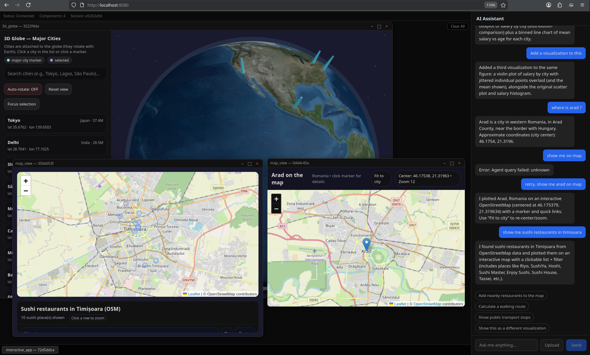
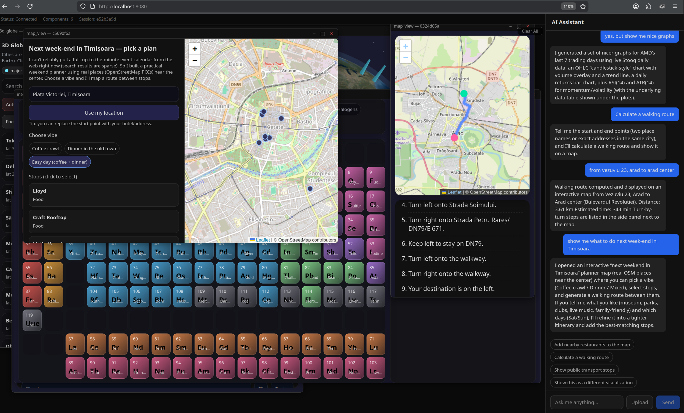

# AI Interface

A universal AI assistant that generates its own UI at runtime. Instead of predefined templates, the LLM decides both **what data to show** and **how to visualize it** — producing complete HTML/CSS/JS components rendered in sandboxed iframes, orchestrated through a floating window manager that works like a desktop OS.



Ask it to search the web, display a 3D globe, build an interactive periodic table, show a map with restaurants, read an article, run Python code with matplotlib charts — it figures out the best visualization and builds it live.



## How It Works

**The LLM is the UI engine.** There are no predefined components. When you ask a question:

1. The LLM analyzes your request and calls tools (web search, geocoding, page fetching, etc.)
2. It generates complete HTML/CSS/JS for the visualization — loading any library from any HTTPS CDN
3. The HTML renders inside a sandboxed iframe in a floating window
4. You can drag, resize, minimize, maximize, and close windows like a desktop OS

The LLM can use **any** JavaScript library: Three.js for 3D, Chart.js for charts, Leaflet for maps, D3 for data viz, pdf.js for PDFs, Mermaid for diagrams — or anything else available on a CDN. An import map is pre-configured so bare ESM imports (`import * as THREE from 'three'`) work out of the box.

### What It Can Generate

- **Interactive maps** with markers, routes, and POI search (Leaflet + Nominatim + Overpass + Valhalla)
- **3D scenes** (Three.js) — globes, visualizations, interactive models
- **Charts and dashboards** (Chart.js, D3) — from live web search data
- **Data tables** — sortable, filterable, from any data source
- **Clean article reader** — fetches any URL, strips ads/tracking, renders in a clean reader view
- **PDF viewer** — displays PDFs from URLs or uploads via pdf.js
- **Python code execution** — runs in-browser via Pyodide with pandas, numpy, matplotlib, scipy
- **Interactive apps** — the LLM can build forms, games, tools — anything expressible as HTML/JS
- **Periodic tables, diagrams, timelines** — whatever visualization fits the data

## Try These Prompts

```
Search for latest AI news
```
Searches the web via SearXNG, builds a sortable data table with results.

```
Show me a 3D interactive globe with the 10 most populated cities
```
Generates a Three.js globe with glowing city markers you can rotate.

```
Build an interactive periodic table of elements, color-coded by category
```
Creates a full periodic table with hover tooltips showing element details.

```
Find sushi restaurants in Timisoara and show them on a map
```
Geocodes the city, searches OpenStreetMap POIs, renders a Leaflet map with markers.

```
Fetch and display https://paulgraham.com/greatwork.html
```
Fetches the page, extracts content with Readability, renders a clean ad-free reader view.

```
Write Python code to generate a scatter plot of random data with matplotlib
```
Runs Python in Pyodide, renders matplotlib charts as inline SVGs.

```
Calculate a walking route from Piata Victoriei to the old town in Timisoara
```
Geocodes both points, calculates the route via Valhalla, shows it on a map with turn-by-turn directions.

```
Create a crypto dashboard showing Bitcoin and Ethereum prices
```
Searches for current prices, builds a Bloomberg-terminal-style dashboard with Chart.js.

## Architecture

```
docker compose up -d --build
  |- client      (nginx serving React SPA, proxying /api -> proxy)
  |- proxy       (Node.js orchestration — LLM, tools, session management)
  |- searxng     (private search engine, JSON API)
  |- redis       (valkey, caching for SearXNG)
```

- **packages/client/** — React SPA. Floating window manager, sandboxed iframe rendering, intent validation, file upload. No business logic.
- **packages/proxy/** — Node.js orchestration proxy. Configurable LLM provider (OpenAI-compatible or Anthropic), tool execution, HMAC session tokens, rate limiting. Stateless.
- **packages/shared/** — Shared TypeScript types and crypto utilities.

### Agent Tools

| Tool | Description |
|------|-------------|
| `render_component` | Render any HTML/JS/CSS in a sandboxed iframe window |
| `execute_code` | Run Python (Pyodide) or JavaScript with visible output |
| `web_search` | Search the web via SearXNG (Brave, Bing, Mojeek, Wikipedia, etc.) |
| `fetch_page` | Fetch a URL, extract readable content, auto-render as reader view |
| `geocode` | Resolve place names to coordinates (Nominatim) |
| `search_pois` | Find points of interest nearby (Overpass API) |
| `calculate_route` | Route between two points with directions (Valhalla) |
| `read_file` / `write_file` | Read uploaded files / write downloadable files |
| `show_notification` | Show toast notification |
| `remove_component` | Remove a UI window |

### Security Model

The security boundary is the iframe `sandbox` attribute — not CSP:

1. **Iframe sandbox** — `sandbox="allow-scripts allow-popups allow-popups-to-escape-sandbox"`. No same-origin access, no parent DOM access, no forms.
2. **Wide CSP within sandbox** — `script-src https:` allows any HTTPS CDN. This is safe because the sandbox prevents escaping the iframe.
3. **Session tokens** — HMAC-SHA256 signed, self-validating (no database). Contains session ID, expiry, client fingerprint.
4. **HTTP Message Signatures** — RFC 9421 subset. Every request signed with content digest.
5. **Intent validation** — postMessage from iframes validated with origin check, source check, schema validation, and rate limiting.

### No Database

All state is ephemeral. Client state lives in React. Conversation memory is an in-process Map (last 6 messages). Rate-limit counters use in-process Maps with TTL eviction. Session tokens are self-validating via HMAC.

## Quick Start (Docker)

```bash
# Clone
git clone https://github.com/mihaics/ai-interface.git
cd ai-interface

# Configure
cp .env.example .env
# Edit .env — set your LLM provider and API key

# Run
docker compose up -d --build

# Open http://localhost:8080
```

### Environment Variables

```bash
# LLM Provider: "openai" (any OpenAI-compatible API) or "anthropic"
LLM_PROVIDER=openai

# OpenAI-compatible (Ollama, OpenAI, Groq, Together, etc.)
LLM_BASE_URL=http://localhost:11434/v1
LLM_API_KEY=ollama
LLM_MODEL=qwen2.5:14b

# Anthropic
# LLM_PROVIDER=anthropic
# ANTHROPIC_API_KEY=sk-ant-...
# LLM_MODEL=claude-sonnet-4-20250514

# Required
HMAC_SECRET=generate-a-random-64-char-hex-string
```

## Development (without Docker)

```bash
npm install                    # Install all workspaces
npm run dev                    # Start proxy (3001) + client (5173)
```

You'll also need a SearXNG instance running on port 8080 for web search.

```bash
npm run test                   # Run all tests
npm run dev:proxy              # Proxy only
npm run dev:client             # Client only
npx -w packages/proxy vitest run src/crypto/sessionToken.test.ts  # Single test
```

## Tech Stack

- **Frontend:** React, TypeScript, Vite
- **Backend:** Node.js, Express, TypeScript
- **LLM:** Any OpenAI-compatible API or Anthropic
- **Search:** SearXNG (private, self-hosted)
- **Maps:** Leaflet + Nominatim + Overpass + Valhalla
- **Code Execution:** Pyodide (Python in browser), direct eval (JavaScript)
- **PDF:** pdf.js (CDN, rendered in iframe)
- **Deployment:** Docker Compose (nginx + Node.js + SearXNG + Valkey)

## License

Apache-2.0
